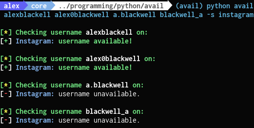

<p align=center>
  <span>Check if your username is available across <a href="https://github.com/theyahya/sherlock/blob/master/sites.md">social networks</a>!</span>
  <br>
  <a target="_blank" href="https://www.python.org/downloads/" title="Python version"></a>
  <a target="_blank" href="LICENSE" title="License: GPL-3.0"></a>
  <a target="_blank" href="https://github.com/sherlock-project/sherlock/actions" title="Test Status"></a>
  <a target="_blank" href="https://microbadger.com/images/theyahya/sherlock"></a>
</p>

## Table of contents
* [Overview](#overview)
* [Examples](#examples)
* [Technologies](#technologies)
* [Installation](#installation)
* [Usage](#usage)


## Overview
Finding a good username is important for an online presence. However, it is often a lot of work to know if the username you want is available. Getting a few the *That username is already taken* prompts, is enough for anyone to just add a ton of numbers after their name. **Avail** automates this process, providing a response to whether a username is available in just a few seconds!

## Examples

> Test multiple usernames for availability

<p align="center">

<a href="https://github.com/Alex0Blackwell/avail">

</a>
</p>

> Check on multiple websites if your name is available

<p align="center">

<a href="https://github.com/Alex0Blackwell/avail">

</a>
</p>

## Technologies

- **Python 3.6**
- **beautifulsoup4**
- **requests**
- **pysocks**
- **colorama**


## Installation

**NOTE**: Python 3.6 or higher is required.

```bash
# clone the repo
$ git clone https://github.com/Alex0Blackwell/avail.git

# change the working directory to sherlock
$ cd avail

# install python3 and python3-pip if they are not installed

# install the requirements
$ python3 -m pip install -r requirements.txt
```

## Usage

```bash
$ python3 avail --help
usage: avail [-h] [--version] [--verbose] [--folderoutput FOLDEROUTPUT] [--output OUTPUT]
                [--tor] [--unique-tor] [--csv] [--site SITE_NAME] [--proxy PROXY_URL]
                [--json JSON_FILE] [--timeout TIMEOUT] [--print-found] [--no-color] [--browse]
                USERNAMES [USERNAMES ...]

avail: Find Usernames Across Social Networks (Version 0.12.3)

positional arguments:
  USERNAMES             One or more usernames to check with social networks.

optional arguments:
  -h, --help            show this help message and exit
  --version             Display version information and dependencies.
  --verbose, -v, -d, --debug
                        Display extra debugging information and metrics.
  --folderoutput FOLDEROUTPUT, -fo FOLDEROUTPUT
                        If using multiple usernames, the output of the results will be saved to
                        this folder.
  --output OUTPUT, -o OUTPUT
                        If using single username, the output of the result will be saved to this
                        file.
  --tor, -t             Make requests over Tor; increases runtime; requires Tor to be installed and
                        in system path.
  --unique-tor, -u      Make requests over Tor with new Tor circuit after each request; increases
                        runtime; requires Tor to be installed and in system path.
  --csv                 Create Comma-Separated Values (CSV) File.
  --site SITE_NAME      Limit analysis to just the listed sites. Add multiple options to specify
                        more than one site.
  --proxy PROXY_URL, -p PROXY_URL
                        Make requests over a proxy. e.g. socks5://127.0.0.1:1080
  --json JSON_FILE, -j JSON_FILE
                        Load data from a JSON file or an online, valid, JSON file.
  --timeout TIMEOUT     Time (in seconds) to wait for response to requests. Default timeout of
                        60.0s.A longer timeout will be more likely to get results from slow
                        sites.On the other hand, this may cause a long delay to gather all results.
  --print-found         Do not output sites where the username was not found.
  --no-color            Don't color terminal output
  --browse, -b          Browse to all results on default browser.
```

To search for only one user on a website:
```
python3 avail user123 -s website
```

To search for more than one user on a website:
```
python3 avail user1 user2 user3 -s website
```

Accounts found will be stored in an individual text file with the corresponding username (e.g ```user123.txt```).

## Anaconda (Windows) Notes

If you are using Anaconda in Windows, using 'python3' might not work. Use 'python' instead.

## Docker Notes

Docker is not currently set up to run Avail.

## Tests

Thank you for contributing to Avail!

Before creating a pull request with new development, please run the tests
to ensure that everything is working great.  It would also be a good idea to run the tests
before starting development to distinguish problems between your
environment and the Sherlock software.

The following is an example of the command line to run all the tests for
Avail. This invocation hides the progress text that Sherlock normally
outputs, and instead shows the verbose output of the tests.

```
$ cd avail/avail
$ python3 -m unittest tests.all --verbose
```

Note that we do currently have 100% test coverage.  Unfortunately, some of
the sites that Avail checks are not always reliable, so it is common
to get response problems.  Any problems in connection will show up as
warnings in the tests instead of true errors.

If some sites are failing due to connection problems (site is down, in maintenance, etc)
you can exclude them from tests by creating a `tests/.excluded_sites` file with a
list of sites to ignore (one site name per line).

## Limitations
- [ ] Docker not currently set up to run Avail


## License

Licensed under the [GNU General Public License v3.0](LICENSE)

Avail Creator - [Alex Blackwell](https://github.com/Alex0Blackwell)  
Original Creator of [Sherlock](https://github.com/sherlock-project/sherlock) - [Siddharth Dushantha](https://github.com/sdushantha)
